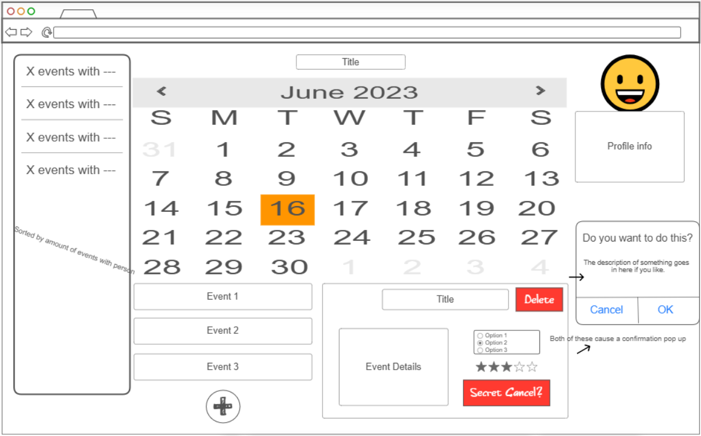

# Spoon Saver Calander

[My Notes](notes.md)

A brief description of the application here. Lorem ipsum dolor sit amet, consectetur adipiscing elit, sed do eiusmod tempor incididunt ut labore et dolore magna aliqua. Ut enim ad minim veniam, quis nostrud exercitation ullamco laboris nisi ut aliquip ex ea commodo consequat. Duis aute irure dolor in reprehenderit in voluptate velit esse cillum dolore eu fugiat nulla pariatur. Excepteur sint occaecat cupidatat non proident, sunt in culpa qui officia deserunt mollit anim id est laborum.

> [!NOTE]
>  This is a template for your startup application. You must modify this `README.md` file for each phase of your development. You only need to fill in the section for each deliverable when that deliverable is submitted in Canvas. Without completing the section for a deliverable, the TA will not know what to look for when grading your submission. Feel free to add additional information to each deliverable description, but make sure you at least have the list of rubric items and a description of what you did for each item.

> [!NOTE]
>  If you are not familiar with Markdown then you should review the [documentation](https://docs.github.com/en/get-started/writing-on-github/getting-started-with-writing-and-formatting-on-github/basic-writing-and-formatting-syntax) before continuing.

## 🚀 Specification Deliverable

> [!NOTE]
>  Fill in this sections as the submission artifact for this deliverable. You can refer to this [example](https://github.com/webprogramming260/startup-example/blob/main/README.md) for inspiration.

For this deliverable I did the following. I checked the box `[x]` and added a description for things I completed.

- [x] Proper use of Markdown
- [x] A concise and compelling elevator pitch
- [x] Description of key features
- [x] Description of how you will use each technology
- [x] One or more rough sketches of your application. Images must be embedded in this file using Markdown image references.

### Elevator pitch

The concept for this startup is a colaborative calander designed to easily indicate the amount of energy and preperation required for scheduled activities. It will be designed for those who struggle with overplanning, providing a score for how much energy an activity would require. Tags such as travel, packing, or workout could be added to each activity for an easy view of what to plan for. The user would also have the option to indicate a secret desire to cancel. This indication remains secret unless all parties indicate that they wish to cancel, in which case the event is deleted.

### Design

This is my design for my startup

### Key features

- The calander will allow for collaborative planning of events
- Certain indicators can be marked to allow the program to provide a rough idea of how much energy is being spent on the plans that are made
- Provides an option to mark a desire for the planned event to be cancled. Should all parties involved mark this, the calander will cancel the plans automatically.

### Technologies

I am going to use the required technologies in the following ways.

- **HTML** - I will use this for organizing the the elements of the calander
- **CSS** - I will use this to animate the drop down and expansions of selected events so that they slide into place rather than just appearing
- **React** - This will allow the users to select different days on the calander, select event collaborators, and edit events
- **Service** - The user will be able to login to see their events and search for collaborators
- **DB/Login** - Events and users will be stored on the database
- **WebSocket** - Creation of, feelings toward, and deletion of events will be communicated to the server

## 🚀 AWS deliverable

For this deliverable I did the following. I checked the box `[x]` and added a description for things I completed.

- [x] **Server deployed and accessible with custom domain name** - [My server link](https://startup.packerbarlow.click/).

## 🚀 HTML deliverable

For this deliverable I did the following. I checked the box `[x]` and added a description for things I completed.

- [x] **HTML pages** - I have 4 pages for my HTML code. 1 for the main calander, 1 for a login, 1 for an analysis of activities, and 1 for an about section
- [x] **Proper HTML element usage** - I tried to make sure that all of my elements in my HTML files were correct and easy to identitfy
- [x] **Links** - I have links to my GitHub and links to each of the pages
- [x] **Text** - I have descriptions in the about, and titles on each of the pages
- [x] **3rd party API placeholder** - I have a spot for a calander. I wasn't sure how it will be implimented later, so some adjustments may need to be made
- [x] **Images** - I have a spot for an image in the about section
- [x] **Login placeholder** - I have a login spot
- [x] **DB data placeholder** - I have a place to create an acount
- [x] **WebSocket placeholder** - I have buttons that I plan to have do stuff

## 🚀 CSS deliverable

For this deliverable I did the following. I checked the box `[x]` and added a description for things I completed.

- [x] **Header, footer, and main content body** - I formatted a header and footer that stayed where I wanted and looked how I wanted
- [x] **Navigation elements** - I built the navigation to go where it is supposed to and to show where someone is at
- [x] **Responsive to window resizing** - It adjusts as the window changes sizes
- [x] **Application elements** - There are buttons and forms to fill out along with tables for organization
- [x] **Application text content** - I gave those applications text and formatted it
- [x] **Application images** - I found an image that seemed relevent

## 🚀 React part 1: Routing deliverable

For this deliverable I did the following. I checked the box `[x]` and added a description for things I completed.

- [x] **Bundled using Vite** - I did it.
- [x] **Components** - Got it done
- [x] **Router** - Is working

## 🚀 React part 2: Reactivity deliverable

For this deliverable I did the following. I checked the box `[x]` and added a description for things I completed.

- [x] **All functionality implemented or mocked out** - I made it so events could be created and so people could think they're logging in
- [x] **Hooks** - I got this done

## 🚀 Service deliverable

For this deliverable I did the following. I checked the box `[x]` and added a description for things I completed.

- [x] **Node.js/Express HTTP service** - I got those going
- [x] **Static middleware for frontend** - Also working
- [x] **Calls to third party endpoints** - My login does that.
- [x] **Backend service endpoints** - Does have
- [x] **Frontend calls service endpoints** - Does do.
- [x] **Supports registration, login, logout, and restricted endpoint** - My login does all of these things.

## 🚀 DB deliverable

For this deliverable I did the following. I checked the box `[x]` and added a description for things I completed.

- [ ] **Stores data in MongoDB** - I did not complete this part of the deliverable.
- [ ] **Stores credentials in MongoDB** - I did not complete this part of the deliverable.

## 🚀 WebSocket deliverable

For this deliverable I did the following. I checked the box `[x]` and added a description for things I completed.

- [ ] **Backend listens for WebSocket connection** - I did not complete this part of the deliverable.
- [ ] **Frontend makes WebSocket connection** - I did not complete this part of the deliverable.
- [ ] **Data sent over WebSocket connection** - I did not complete this part of the deliverable.
- [ ] **WebSocket data displayed** - I did not complete this part of the deliverable.
- [ ] **Application is fully functional** - I did not complete this part of the deliverable.
